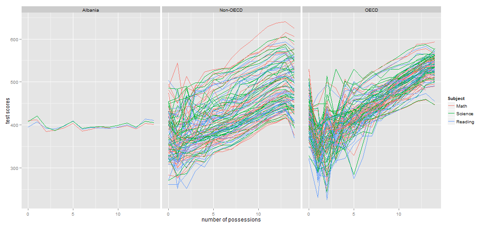
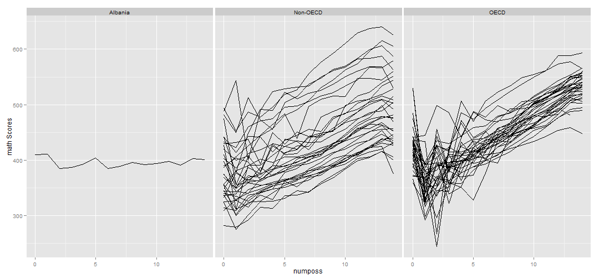
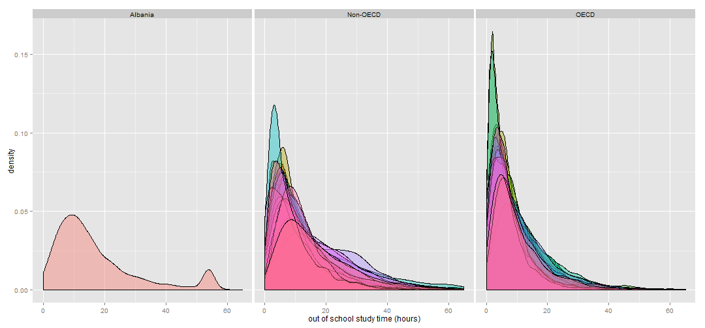
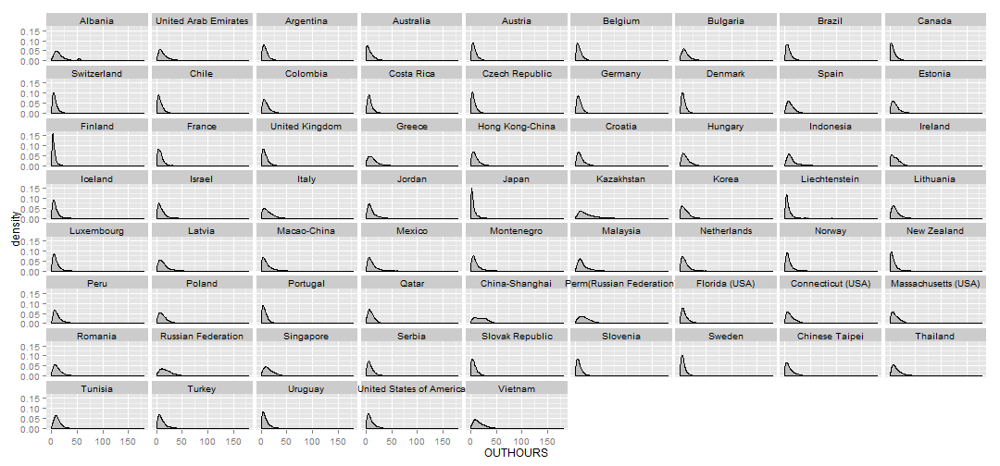
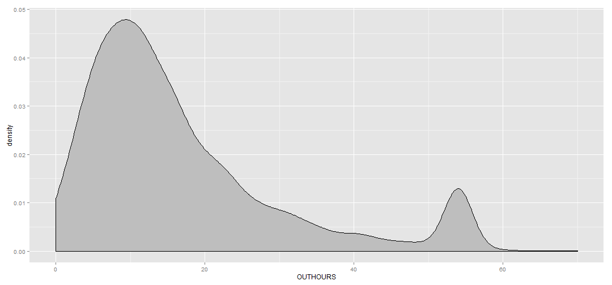
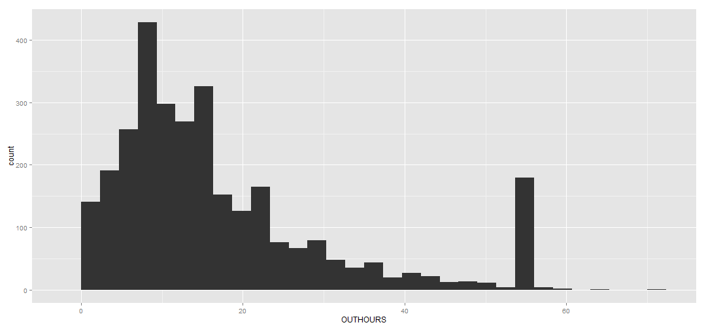
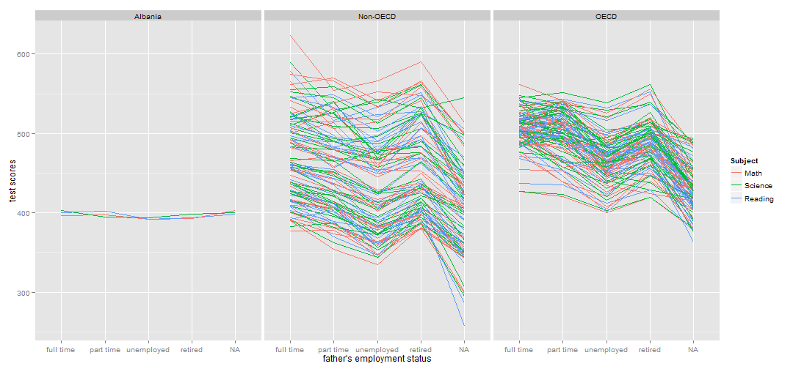
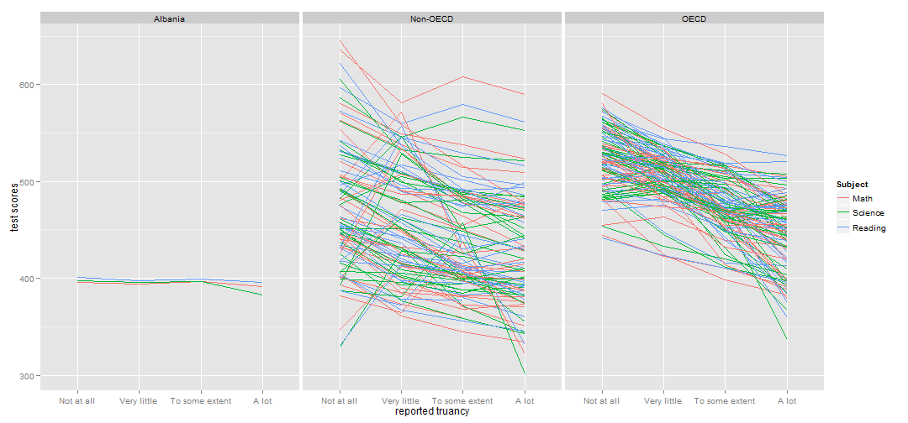
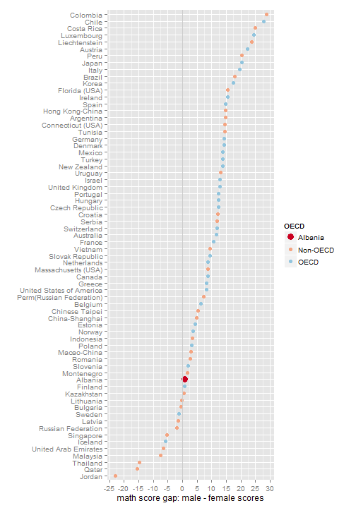
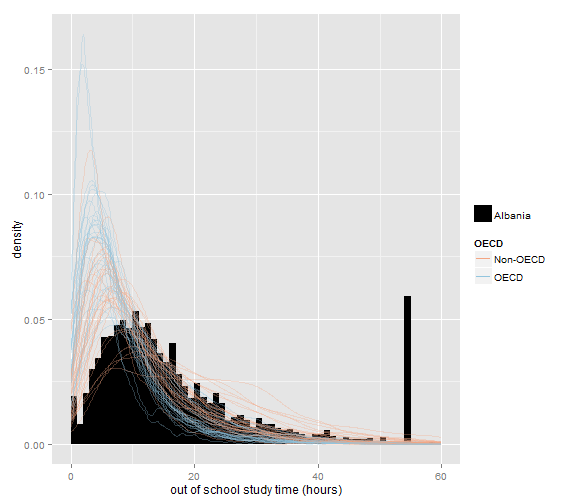

Albania
=============

 
 
    
 
 
  


.width = 1

data_small <- 
  student2012 %>%
  select(OECD, CNT, OUTHOURS) %>%
  filter(!is.na(OUTHOURS))

ggplot(mapping = aes(x = OUTHOURS)) + 
  scale_x_continuous(name = "out of school study time (hours)", limits = c(0,60)) +
  scale_y_continuous(name = "density") +
  geom_histogram(
    mapping = aes(y = ..density.., fill = OECD), 
    binwidth = .width,
    data = data_small %>% filter(OECD == "Albania")
  ) + 
  scale_fill_manual(
    values = "black",
    breaks = "Albania",
    guide = guide_legend(title = "")
  ) + 
  geom_line(
    mapping = aes(group = CNT, color = OECD), 
    stat = "density", 
    alpha = 0.3,
    data = data_small %>% filter(OECD != "Albania")
  ) +
  scale_color_discrete(
    guide = guide_legend(
      title = "Other Countries",
      override.aes = list(alpha = 1)
    )
    
  ) +
  scale_colour_manual(values = c("#f4a582", "#92c5de")) + guides(colour = guide_legend(override.aes = list(alpha = 1)))


 
