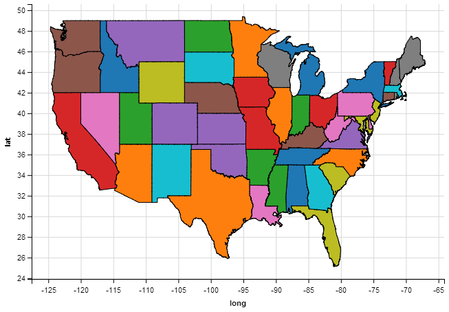

This is a small example of plotting a map with ggvis similar to how you would plot a map on ggplot2.  The biggest upgrade is the interactivity possible with ggvis. 

If you run the following code into R or embed with shiny you can enable things like clicking.  The following code has clicking enabled; currently it doesn't do much except print lat/long and state name to console but this can be extended to interacting with other plots.


#interactive map with ggvis
library(ggvis)
library(dplyr)
map_data = ggplot2::map_data("state")
map_data %>% select(long, lat, group, order, region) %>% 
  group_by(group) %>% 
  ggvis(x = ~long, y = ~lat) %>% 
  layer_paths(fill = ~region) %>%
  hide_legend("fill") %>% 
  handle_click(on_click = function(data, ...) {print(data)}) 


