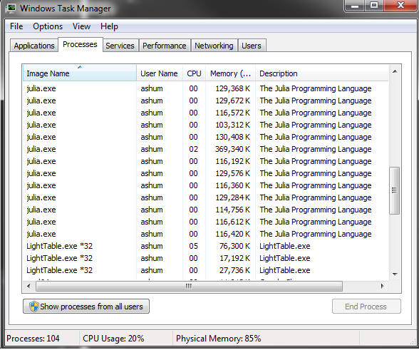

Parallel basics
---------------
Julia's parallel processing is based on message passing and allows multiple processes in separate memory domains.  At the lower level Julia's parallel processing is based around the idea of remote references and remote calls.  

* Remote call: a request to run a function on another processor.
* Remote reference: an object used to refer to objects stored on a particular processor.

By default Julia uses just a single process.  To start Julia with multiple processors from the command line using ``julia -p n``.  If you are not using Julia from the command you can use ``addprocs(n)`` from inside Julia.  In both cases ``n`` is the number of processes to spawn.  In general you want to spawn a number of processes equal to the number of cores in your processor.

The lower level functions for parallel processing are ``remotecall(p, fn, ...)`` where ``p`` is the worker and ``fn`` is the function to run followed by additional parameters.


#add 3 workers
addprocs(3)

#run a command on a different worker
rmatrix = remotecall(4, rand, 2, 2)
print(rmatrix)


The remote call will run ``rand(2,2)`` on process 4.  What is actually returned from this command?  If you print it you should see something like ``RemoteRef(4,1,10)``.  Instead of returning a matrix object, ``remotecall`` will return a reference to the memory location associated with this processor.  To actually get the results use the ``fetch`` function.

Note: becareful about how many times you run ``addprocs`` inside a Julia session:


Here are a few other ways to remote call:
```
#call and fetch in one statement
#you don't need to save a reference this way
remotecall_fetch(4, rand, 2, 2)

#Also can use these macros
m1 = @spawnat 3 rand(2,2)
m2 = @spawn rand(3,3)
```
You can also use macros to ``remotecall`` commands; this allows you to pass an expression instead of a function.

Remember that each process has a separate memory domain.  If you generate results on one process you need to be careful about how to access the results on another process:
```
#matrix is created on process 3
big_matrix = @spawnat 2 rand(100, 100)

#add 1 to all elements
@spawn rand(100, 100) + big_matrix

#you will need to do this instead:
@spawn rand(100, 100) + fetch(big_matrix)
```
Since each process has its own memory when you call ``fetch`` you are explicitly moving data.  You need to becareful how you use ``fetch``.


When you spawn processes you will need to be careful as well.  Julia hides a lot of bookkeeping for a lot of the parallel processing backend but you can still end up doing something stupid:

```
message = "This string is constructed locally"
shouting_message = @spawn uppercase(message)
```
The locally constructed string now needs to be sent to one of the worker processes; this creates more work since the data needs to be sent between processes.  In the above example a string is constructed locally and sent to another process.  Both of these operations should be done on the same remote process:
```
@spawn lowercase("YOU CAN NEVER HAVE TOO MANY COOKS!")
```

For writing functions the ``@everywhere`` tag will insure that all the processes have access to the function.  This will define the function on all processes.  If you don't do this then you will get an error message about the function not being defined on the remote process.
```
function adjective()
  adj = ["algebraic!", "redododiculous"]
  return(adj[rand(1:2)])
end

#this will not work as expected unless you only have 1 active process
@spawnat 2 string("Cheeseburgers are ", adjective())

@everywhere function adjective2()
  adj = ["algebraic!", "redododiculous"]
  return(adj[rand(1:2)])
end

#this will work correctly
@spawnat 2 string("Cheeseburgers are ", adjective2())
```

Actually useful functions
-------------------------
The above was a brief demonstration for how Julia handles parallelization in the background.  In practice you will rarely actually manually spawn processes.  The two most important commands are ``pmap`` and ``@parallel``.

``pmap`` is similar to ``sapply`` in R.  ``pmap(fn, input)`` will run the function for each element of the input.  ``pmap`` is optimized for situations where each function call does a large amount of work.  Let's look at an example of something written without parallelization and similar code written using ``pmap``.

The following is some code to calculate pi from random numbers: generate unif(0, 1) x unif(0, 1) and calculate the proportion such that x^2 + y^2 < 1.
```
tic()
numIter = 200000000 
rand_coords = rand(numIter, 2) .^ 2
num_in_circle = sum(rand_coords[:,1] + rand_coords[:,2] .< 1)
ans = 4 * num_in_circle / numIter
toc()
print(ans)
```
For 200,000,000 iterations it takes my computer ~55 seconds to calculate pi as above.  Below is a rewrite of the code to take advantage of parallelization using ``pmap``:
```
addprocs(3)
@everywhere function circle_number(numIter)
  rand_coords = rand(numIter, 2) .^ 2
  return(sum(rand_coords[:,1] + rand_coords[:,2] .< 1))
end

tic()
numIter2 = convert(Int64, numIter/4)
M = {numIter2 for i = 1:4}
sum_answer = pmap(circle_number, M)
ans = sum(sum_answer) / numIter2
toc()
print(ans)
```
Instead of running all 200,000,000 iterations together the above code splits the number of iterations into 4 equal segments and runs them in parallel.  The above code executed in ~27 seconds on my desktop.  It uses four processes and is about twice as fast; parallelization has a bit of overhead.

``@parallel`` is for parallelizing loops.  Iterations will run independently over different processes and the results will be combined at the end (uses the map-reduce concept).  Unlike ``pmap``, ``@parallel`` is used for functions that are inexpensive to calculate.  In order to use ``@parallel`` a correct "reduce" operation must be specified.  Here is code to calculate pi using a parallel loop:
```
tic()
numIter = 200000000
in_circle = @parallel (+) for i = 1:numIter
  int(sum(rand(2) .^2) < 1)
end
toc()
print(4 * in_circle / numIter)
```
The above code takes ~27 seconds to execute on my desktop.  Note here this iterative approach has similar performance to the above parallelization using ``pmap``.  Unlike what you would see in R code written iteratively will have similar performance.

Caution should be used for this approach; unlike in a normal iterative loop, the iterations will not have a specified order.  The following code will not work as expected.  
```
a = zeros(100000)
@parallel for i=1:100000
  a[i] = i
end
```
The problem with the above is that each process will have a separate copy of ``a`` and the vector will not be filled in with ``i`` as expected.  It's possible to get the intended behavior with a distributed array or shared array.

#####Short note on distributed arrays and shared arrays
Distributed arrays are large arrays where each processes has access to a subset of the array.  Shared arrays are arrays where each process has access to the entire array.  